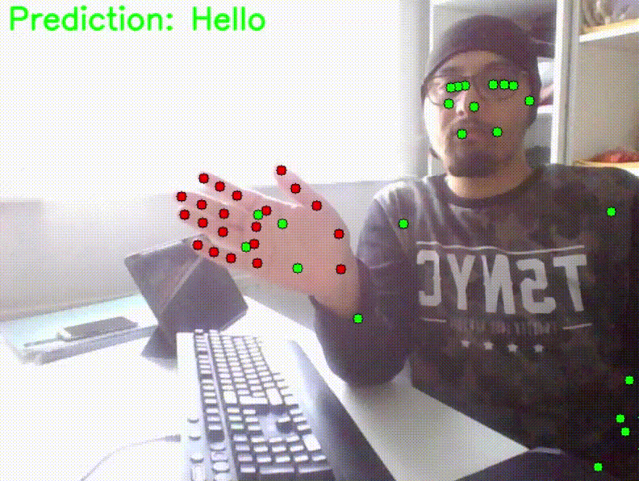

# Sign language computer vision - Gesture Recognition System

UnMute is a comprehensive gesture recognition system designed to detect and classify hand gestures in real-time. It incorporates two primary approaches for gesture recognition: Motion Sign Detection System and Static Sign Detection System. These approaches leverage MediaPipe for hand landmark detection and a neural network model for gesture classification, enabling applications in human-computer interaction, sign language recognition, and more.

## Table of Contents

- [Overview](#overview)
- [Features](#features)
  - [Demos](#demos)
- [Installation](#installation)
- [Usage](#usage)
  - [Motion Sign Detection System](#motion-sign-detection-system)
  - [Static Sign Detection System](#static-sign-detection-system)
- [Model Training](#model-training)
- [Real-time Gesture Recognition](#real-time-gesture-recognition)
- [Contributing](#contributing)
- [License](#license)

## Overview

UnMute provides two main approaches for gesture recognition:

1. **Motion Sign Detection System**: Detects dynamic hand movements or gestures over time.
2. **Static Sign Detection System**: Identifies static hand gestures in a single frame.

## Features

- Real-time hand gesture recognition using a webcam.
- Dynamic and static gesture detection.
- Model training and evaluation.
- Easy-to-use interface for data collection and gesture classification.

### Demos
1. **Run the gesture recognition script to create a dataset:**
   


2. **Run the real-time gesture recognition script using the trained model:**
   



## Installation
To install and set up the UnMute project, follow these steps:

1. **Clone the repository:**
   ```bash
   git clone https://github.com/your-username/UnMute.git
   cd UnMute
   ```

2. **Create a virtual environment:**
   ```bash
   python -m venv venv
   source venv/bin/activate  # On Windows use `venv\Scripts\activate`
   ```

3. **Install dependencies:**
   ```bash
   pip install -r requirements.txt
   ```

## Usage

### Motion Sign Detection System

The Motion Sign Detection System captures and analyzes hand movements over a period, allowing for the recognition of dynamic gestures.

1. **Run the data collection script:**
   ```bash
   python motion_data_collection_webcam.py
   ```

2. **Controls:**
   - Press `A` to start recording.
   - Press `S` to stop recording.
   - Press `D` to save the recording with a label.

The collected data will be saved in `motion_hand_landmarks.csv`.

### Static Sign Detection System

The Static Sign Detection System recognizes static hand gestures from single frames.

1. **Run the data collection script:**
   ```bash
   python linear_data_collection_webcam.py
   ```

2. **Controls:**
   - Press `A` to start recording.
   - Press `S` to stop recording.
   - Press `D` to save the recording with a label.

The collected data will be saved in `static_hand_landmarks.csv`.

## Model Training

The model training process involves loading the collected hand landmark data, preprocessing it, training a neural network model, and converting the model to TensorFlow Lite format.

1. **Load the landmarks data from `hand_landmarks.csv`.**
2. **Preprocess the data**:
   - Extract labels and features.
   - Encode labels into integers and convert them to categorical.
   - Split the data into training and test sets.

3. **Train the model**:
   - Open `Model training.ipynb` in Jupyter Notebook.
   - Run the notebook cells to load data, preprocess it, train the model, and save it in TensorFlow Lite format.

4. **Convert the model to TensorFlow Lite format**:
   - Save the TensorFlow Lite model for deployment.

## Real-time Gesture Recognition

The real-time gesture recognition system captures video frames from a webcam, detects hand landmarks, normalizes them, and uses the trained model to classify gestures.

1. **Run the real-time gesture recognition script:**
   ```bash
   python real_time_gesture_recognition.py
   ```

2. **Components**:
   - Video capture and hand landmark detection using MediaPipe.
   - Landmark normalization.
   - Gesture classification using the trained model.
   - Display the recognized gesture on the video feed.


## Contributing

Contributions are welcome! If you would like to contribute to UnMute, please follow these steps:

1. Fork the repository.
2. Create a new branch (`git checkout -b feature-branch`).
3. Commit your changes (`git commit -am 'Add new feature'`).
4. Push to the branch (`git push origin feature-branch`).
5. Create a new Pull Request.

## License

This project is licensed under the MIT License. See the [LICENSE](LICENSE) file for details.
